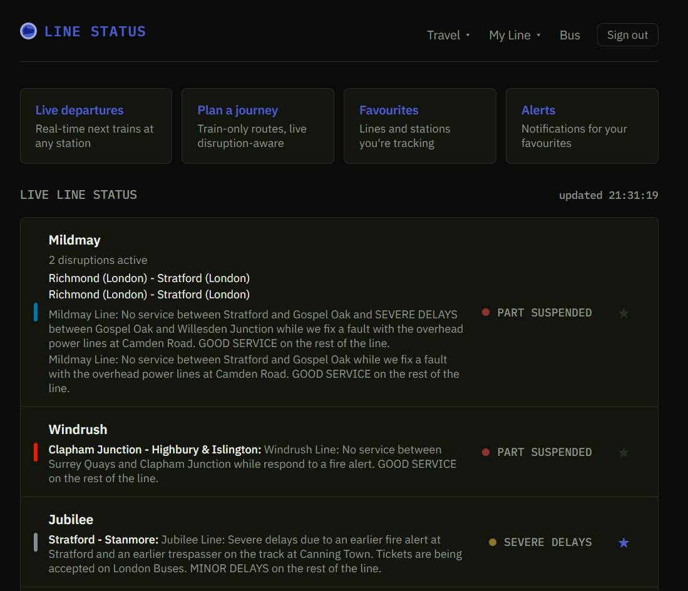
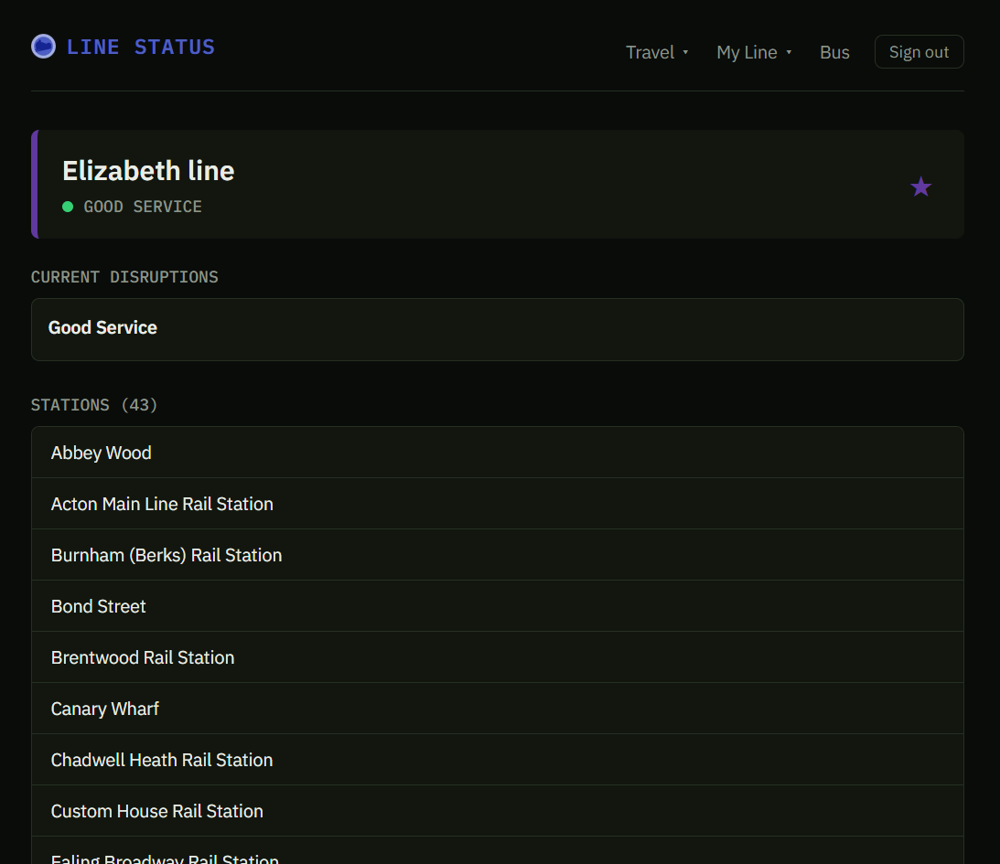
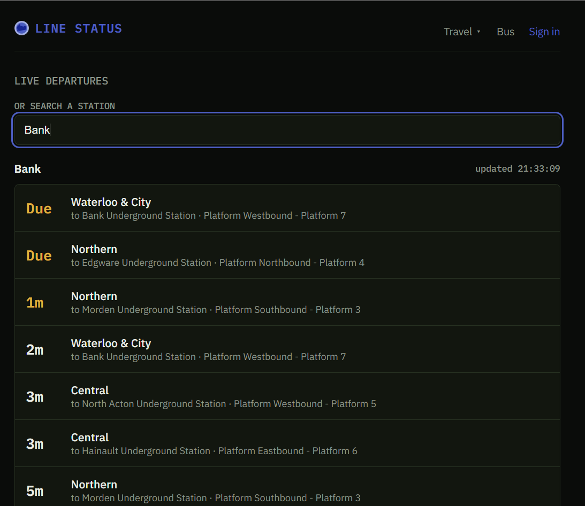
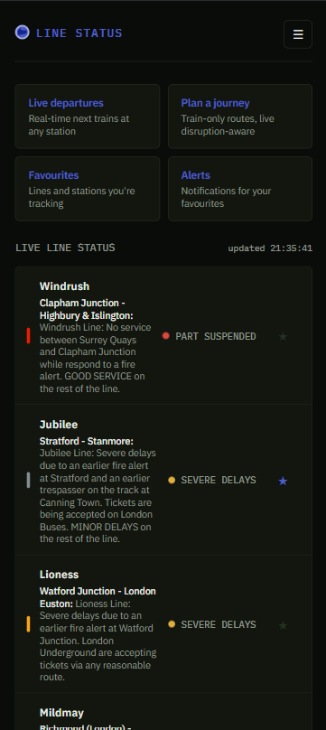
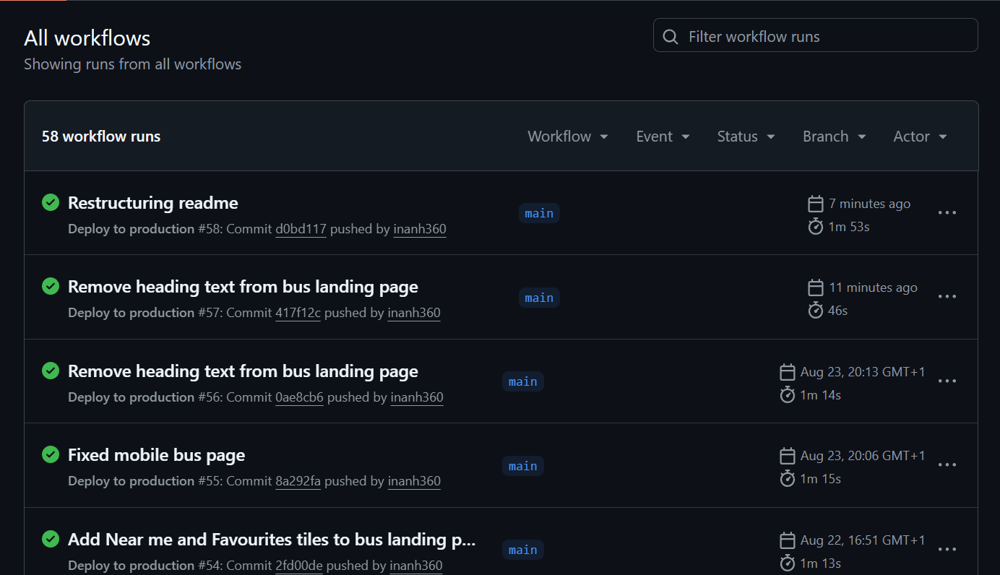

# Line Status

A live status board, journey planner, and disruption alert app for London transport, built on data from TfL's public API. Covers every London train service and, as a deliberately separate section with its own look, London buses too.

Live at [linestatus.co.uk](https://linestatus.co.uk)






## What it does

- **Live line status.** Every train line in London, tube, DLR, Overground, and the Elizabeth line, shown with its current status. Delays and disruptions show the actual affected branch and TfL's own reason text, not just a generic warning.
- **Journey planning.** Train only routes between two stations, using TfL's own journey planner, with disrupted legs flagged clearly.
- **Live departures.** Real time next train predictions for any station, refreshing automatically. The same live departures board exists for buses too, kept as its own separate part of the app with its own theme.
- **Find the best nearby station.** Uses the browser's own location to find the closest stations, working out which one is actually fastest to use once real walking time and the next train's actual departure time are both accounted for, not just whichever is geographically closest. Available for both trains and buses.
- **Push notifications.** Signed in users can favourite specific lines, stations, and bus stops, and get a real notification the moment something they're tracking is disrupted, even with the site closed. A background service checks TfL's live data every 90 seconds and only sends a notification when something genuinely changes, not on every check.
- **Smart favourites.** A favourited station's preview shows only trains on the lines that person has also favourited, rather than just whatever happens to be soonest, so a station served by five lines does not get dominated by whichever one runs most often.
- **Large interchange stations handled properly.** TfL represents a station like this as several separate ids internally rather than one, so getting a complete picture means finding and merging results across all of them rather than trusting whichever single id a search happens to return.

## Why this is more than a typical personal project

Most of what makes this worth showing isn't the frontend, it's everything underneath it. This was built and deployed the way a small production service actually gets run, not just coded and left on a laptop.

- **Real infrastructure, not a managed platform shortcut.** The app runs on its own Linux server, provisioned and configured from scratch, not a one click hosting platform. That includes a proper firewall, a dedicated non-root user for daily access with SSH key only login, root login disabled entirely, and Docker configured so that user can run containers without needing admin rights for every command.
- **Containerised and reproducible.** The backend, the background poller, and the frontend each run in their own Docker container, built from multi stage Dockerfiles designed to keep the final images small. The exact same setup runs identically on a laptop or on the live server, with a separate configuration file for local development versus production so nothing about the production setup, like the reverse proxy, ever gets accidentally run locally.
- **Automatic deployment.** Every push to the main branch triggers a GitHub Actions workflow that connects to the server over SSH and redeploys automatically. No manual steps, no uploading files by hand.
- **Real HTTPS, properly automated.** A Caddy reverse proxy sits in front of the app, obtaining and renewing free HTTPS certificates on its own, and is the only thing exposed to the internet. The application containers themselves are not directly reachable from outside.
- **Actual security hardening, not just a login form.** Row Level Security is enabled on every database table, so even if the database's own public API were somehow reached directly, it could not be used to read or change anyone's data. Every request is authenticated with a properly verified token, not a value the browser could be tricked into faking. Rate limiting is in place and correctly configured to work behind a reverse proxy, which is a detail that is easy to get wrong and silently insecure if missed. Security headers and a Content Security Policy are set on every page.
- **Privacy and data rights, done properly.** The app has a written privacy policy, and any signed in user can permanently delete their account and every piece of data attached to it, not just from the app but from the underlying authentication system too.
- **A real bug and decision log.** Every non trivial bug found during development, why it happened, and how it was fixed is written up in [BUGFIXES.md](./BUGFIXES.md) in this repository. It is the most honest record of the actual engineering work behind this project.

## Tech stack

- **Frontend:** Next.js, React, TypeScript. Deployed as a Docker container, not on a third party hosting platform.
- **Backend:** Node.js, Express, TypeScript. A separate background service polls TfL's API and manages disruption state and notifications. Push notifications are sent using the standard Web Push protocol, with a service worker on the frontend to receive and display them even when the site itself isn't open.
- **Database and auth:** PostgreSQL, managed through Prisma. User authentication and magic link sign in is handled by Supabase Auth, verified independently on the backend using a proper server side token check, not trusted blindly from the frontend.
- **Infrastructure:** Docker and Docker Compose for every service. Caddy as a reverse proxy with automatic HTTPS. A Linux server on Hetzner Cloud, hardened with a proper firewall and SSH key only access. GitHub Actions for automatic deployment on every push.
- **External data:** Transport for London's own public Unified API, used for live status, journey planning, and arrival predictions.

## Local development

1. Clone the repository
2. Copy `.env.example` to `.env` and fill in real values
3. Run:

```
docker compose up --build
```

This starts the API, the background poller, and the frontend together, using the local development configuration. The production specific pieces, like the reverse proxy, are kept in a separate file and are never used locally.
